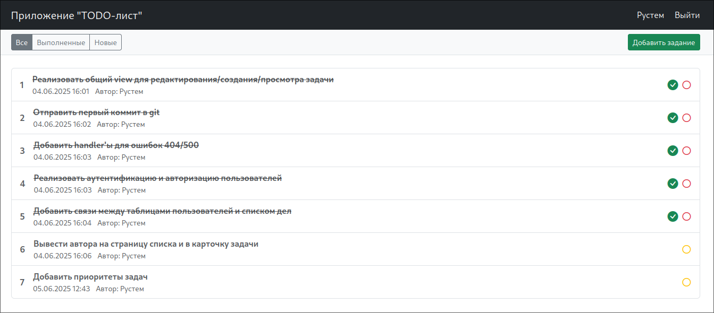

# job4j_todo — TODO лист

### Стек технологий:

+ **Spring Boot 3.5.0**
+ **Lombok 1.18.38**
+ **Hibernate 6.6.13.Final**
+ **PostgreSQL 42.7.6**
+ **Liquibase 4.32.0**
+ **Thymeleaf 3.1.3**
+ **Bootstrap 5.3.6**

---
## Описание

### Приложение позволяет:
+ Просматривать список всех задач
+ Фильтровать задачи по статусу: все / выполненные / новые
+ Добавлять новые задачи
+ Отмечать задачи как выполненные
+ Редактировать и удалять задачи

### Архитектура
Проект разделён на три слоя:
+ Контроллеры (controller)
+ Сервисы (service)
+ Слой доступа к данным (store)

---
## Сборка и запуск
1. Убедитесь, что у вас установлен **PostgreSQL** и создана нужная БД `db_todo`.
2. Установите переменные окружения для подключения к БД или пропишите их в `application.properties`.
3. Сборка:
```bash
mvn clean package
```
4. Запуск:
```bash
mvn spring-boot:run
```
---
## Интерфейс
### Список задач

### Карточка задачи

### Форма входа
